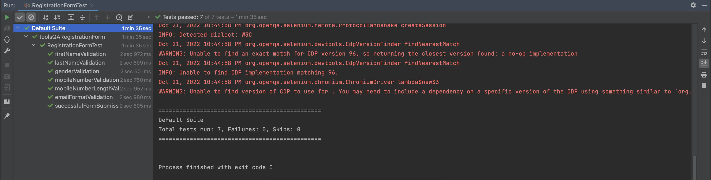

# IgniteTech HomeTask QA Automation Framework

## Tools Used
1. Selenium (Selenium-Java-4.1.4)
2. TestNG
3. Maven (via [wrapper](https://github.com/takari/maven-wrapper))
4. Java SDK 1.8 (Oracle Open JDK Version)
5. [IntelliJ IDE](https://www.jetbrains.com/idea/download/#section=windows) (Install lombok, Gherkins and Cucumber for Java plugins)

## Design Pattern
Page Object Model

## Project Structure

Click to see details

    |src
        |main
            |java
                |toolsQA.test
                    |pageobjects
                    |resources
                    |utility                            
        |test
            |java
                |toolsQA.automation
                    |testcomponents
                    |tests
                       

## java.toolsQA.test

### pageobjects

Contains all the methods related to Registration page that use locators to interact with web elements and perform certain actions.

### resources

Contains two properties files. One as global properties and second as studentInfo. Both contains static data.

### utility

Contains Utils class that interacts with the properties files to read data

## test.java.toolsQA.automation

Contains all the automated test cases

### testcomponents

Contains BaseTest class which performs basic functionalities to run tests like initializing Chrome driver etc.

### tests

Contains all the automated test cases of Registration page

## Execution

Click to see details

There are multiple ways to execute the framework;

### Execution from RegistrationFormTest.java file

We can also execute by clicking the play button available adjacent to the RegistrationFormTest class with in the IDE

### Execution through Maven commands (Preferred Method)

To execute the framework we need to execute the "mvn test" command in terminal which will execute all test case.

## ScreenShots

